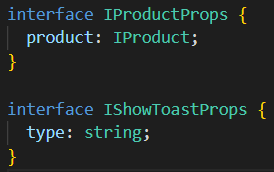
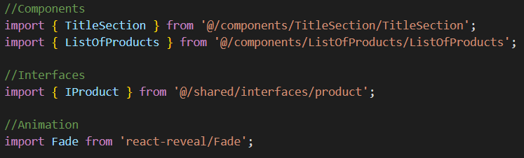
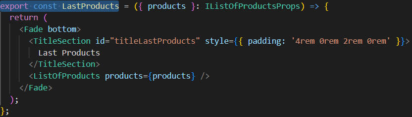
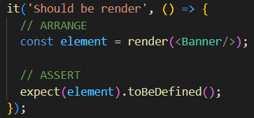
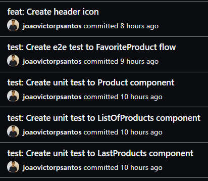
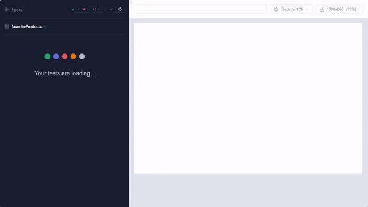

# Next Project Boilerplate

<blockquote align="center">
  This project is open-source, you can contribute too :D
</blockquote>

<hr/>

## 💡 About the project:

A boilerplate created by NextJS, TypeScript, unit tests, end to end tests and much more.

## 🔥 Project patterns

- Use images webp instead images png because it improve the site optimization in render images.
- To name the interfaces, it should follow the pattern: I + (component or function name) + Props, for example: IProductProps.


- Organize imports into assets, components, hooks, styles, etc.


- At each commit, the unit tests and e2e tests run, and for the e2e test to run, the project must be running locally.
- Do not export components as default, but as a property, but whenever imported, it is not possible to change its name.


- Always check that dependencies not needed for production are as development dependencies.
- Comment unit tests with //ARRANGE, //ACT and //ASSERT, for better understanding.


- Always use relative REM measurement.
- Versioning:
    - Use commitlint
    

- Code Validation:
    - Husky
    - Lint-staged
- Code formatting and standardization:
    - Prettier
    - ESLint
    - .editorconfig

## 💻 Example e2e test with Cypress running


## ⚙️ Techs:

- NextJS
- TypeScript
- JavaScript

## 🎈 Run the project locally

- Clone the project:

```bash
git clone git@github.com:joaovictorpsantos/next-ts-boilerplate.git
```

- Download dependencies:

```bash
yarn
```

- Run app:

```bash
yarn dev
```

<br/>

<h4 align="center">
  Let's share knowledge and grow together!!!
</h4>

<br/>

---

<h3 align="center">
Autor: <a alt="João Victor Pereira Santos" href="https://github.com/joaovictorpsantos">João Victor Pereira Santos</a>
</h3>

<p align="center">

  <a alt="João Victor Pereira Santos Linkedin" href="https://www.linkedin.com/in/joao-victor-pereira-santos//">
    </a>
  <a alt="João Victor Pereira Santos GitHub" href="https://github.com/joaovictorpsantos">
  </a>
 <a alt="João Victor Pereira Santos Twitter" href="https://twitter.com/_joaovictorps">
  </a>

</p>
